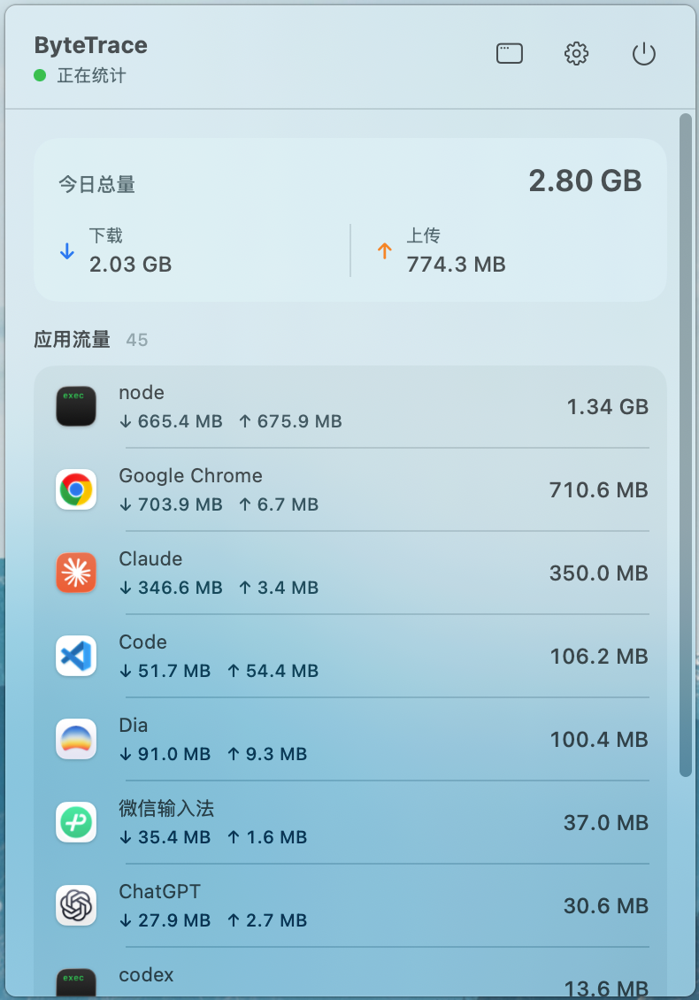
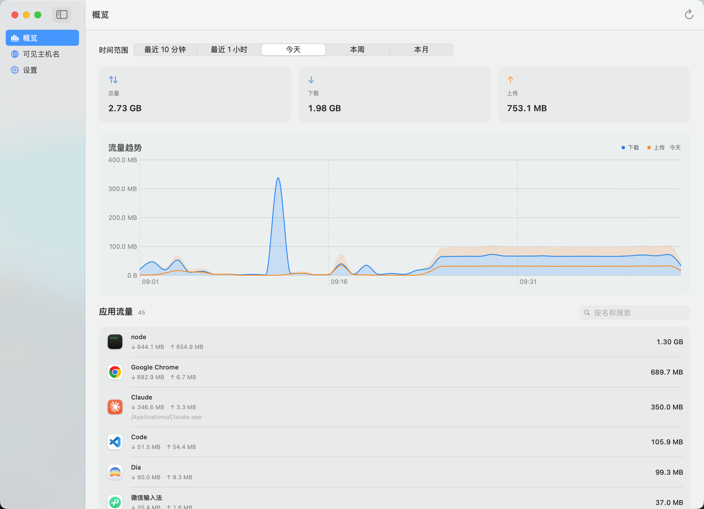

<!-- Logo 占位：仓库暂无适合内嵌的 PNG 图标（Packaging/ 下仅有 .icns），补充后替换本注释：
<p align="center">
  
</p>
-->

<h1 align="center">ByteTrace</h1>

<p align="center">常驻 macOS 菜单栏的应用级流量统计工具:<br>看清每个应用用掉了多少流量、在什么时间段用掉的。</p>

<p align="center">
  
  
  <a href="https://github.com/nanvon/byte-trace/releases/latest"></a>
  
  
</p>

<p align="center">
  <a href="https://github.com/nanvon/byte-trace/releases/latest">下载</a> ·
  <a href="#-安装">安装</a> ·
  <a href="#-从源码构建">从源码构建</a> ·
  <a href="https://github.com/nanvon/byte-trace/issues">反馈</a> ·
  <a href="README_EN.md">English</a>
</p>

<p align="center">
  
</p>

## ✨ 功能

- **菜单栏面板** —— 今日总量／下载／上传汇总,按流量排序的应用列表(带真实应用图标);代理运输流量与系统后台进程各自折叠分组,不混入应用总量;采集状态实时提示,可随时开始或停止
- **代理兼容** —— 同时覆盖直连、TUN 与 macOS 系统代理流量;系统代理端口从系统配置实时读取,无需写死 Clash／Mihomo 的监听端口;代理关闭时不运行回环采集进程
- **主窗口概览** —— 最近 10 分钟／最近 1 小时／今天／本周／本月五档时间范围:汇总卡片、流量趋势图与应用流量排行,点击任一应用进入详情
- **应用详情** —— 单个应用的总量、上下行与独立趋势图
- **设置** —— 分钟级数据保留策略(永不／7／30／90 天)、导出当前范围 JSON、清空统计、显示系统进程、登录时启动

### 📸 界面预览

<p align="center">
  <br>
  <sub>概览:时间范围切换、汇总卡片、流量趋势与应用排行</sub>
</p>

## 📦 安装

🍎 要求 macOS 14 (Sonoma) 或更新版本,Apple Silicon 与 Intel 均支持;无需系统扩展、内核扩展或 root 权限。

1. 从 [Releases](https://github.com/nanvon/byte-trace/releases/latest) 下载对应架构的产物:

   | 你的 Mac                    | 下载文件                                    |
   | --------------------------- | ------------------------------------------- |
   | Apple Silicon(M 系列芯片) | `ByteTrace_<版本>_macOS-Apple-Silicon.dmg`  |
   | Intel                       | `ByteTrace_<版本>_macOS-Intel.dmg`          |

   不确定自己的 Mac 是哪种:点屏幕左上角的苹果菜单 → 「关于本机」,看「芯片」一行。`.zip` 与 `.dmg` 内容相同,免挂载,按喜好选一个。

2. 打开 DMG,把 ByteTrace 拖入「应用程序」。启动后菜单栏出现 ⇅ 图标(应用不在 Dock 中显示),点击图标即开始采集。

3. ByteTrace 未做 Apple 公证,首次启动会被 Gatekeeper 拦截:双击打开被拦下后,到 **系统设置 → 隐私与安全性**,下滑找到 ByteTrace 的提示,点 **「仍要打开」**。

> [!NOTE]
> macOS Sequoia 起,旧的「右键 → 打开」放行方式已失效,只能通过上面的系统设置放行。
> 若仍提示「应用程序已损坏」,可在终端手动去除隔离属性:
>
> ```bash
> xattr -dr com.apple.quarantine /Applications/ByteTrace.app
> ```

每个产物附带同名 `.sha256` 文件与汇总的 `SHA256SUMS.txt`,可校验下载完整性:

```bash
shasum -a 256 -c ByteTrace_<版本>_macOS-Apple-Silicon.dmg.sha256
```

## 🔒 数据与安全

- 唯一数据源是系统自带的只读命令 `/usr/bin/nettop`,不使用 Network Extension
- 仅从 macOS `SystemConfiguration` 读取当前启用的本机代理地址和端口,用于识别应用到代理的回环流量;端点不保存、不展示
- 所有数据保存在本机 SQLite:`~/Library/Application Support/com.nanvon.ByteTrace/usage.sqlite3`,可用任意 SQLite 客户端自行查询
- 不上传、不联网回传任何统计结果
- 不解析报文内容,不解密 HTTPS,不读取请求体

> [!TIP]
> 发布的 `ByteTrace.app` 为 ad-hoc 签名、未做 Apple 公证;如果介意,可以自行审阅代码后[从源码构建](#-从源码构建),不依赖发布的二进制包。

## 🔧 从源码构建

需要 macOS 14 或更高版本,以及包含 Swift 6 工具链的 Xcode。

**日常开发**:`swift build` 构建,`swift test` 跑测试,`swift run ByteTraceApp` 以开发模式运行。

**打包分发**:

```bash
./Scripts/package_app.sh
```

产物位于 `dist/`,包含 `ByteTrace.app`、`ByteTrace.dmg` 与 `ByteTrace.zip`,默认使用 ad-hoc 签名。

> [!WARNING]
> `swift run ByteTraceApp` 运行的是裸可执行文件,读不到 `Packaging/Info.plist`,菜单栏常驻(`LSUIElement`)与应用图标等行为不会生效。验收菜单栏形态请使用 `./Scripts/package_app.sh` 的产物。

## 🙏 致谢

- [`nettop`](https://keith.github.io/xcode-man-pages/nettop.1.html) —— macOS 系统自带的网络统计命令,ByteTrace 的唯一数据源

## 📄 许可证

[MIT](LICENSE)
