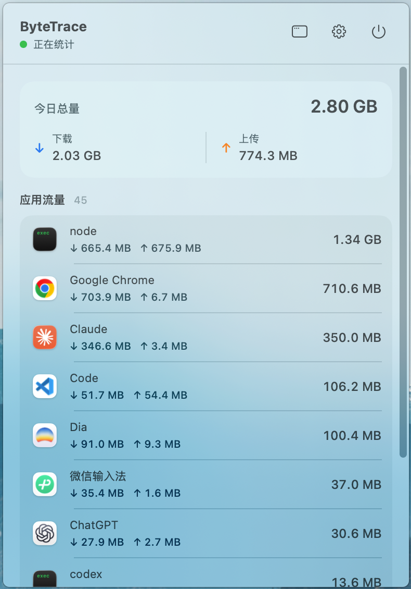
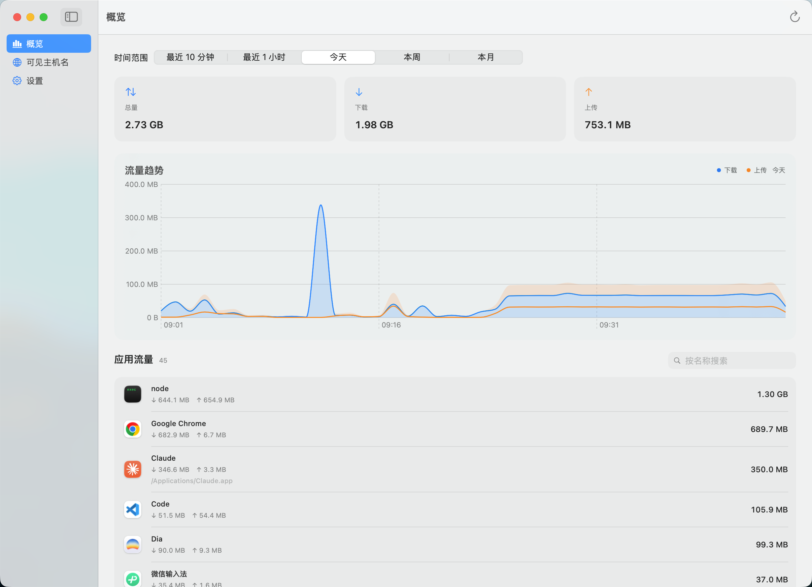

<p align="center">
  
</p>

<h1 align="center">ByteTrace</h1>

<p align="center">
  <b>Native macOS Menu Bar App-Level Network Traffic Monitor</b><br>
  Real-time per-application bandwidth accounting across direct, system proxy, and TUN connections using native system telemetry.
</p>

<p align="center">
  
  
  <a href="https://github.com/nanvon/byte-trace/releases/latest"></a>
  
  
</p>

<p align="center">
  <a href="https://github.com/nanvon/byte-trace/releases/latest">Download</a> ·
  <a href="#-features">Features</a> ·
  <a href="#-screenshots">Screenshots</a> ·
  <a href="#-installation">Installation</a> ·
  <a href="#-data--privacy-security">Data & Security</a> ·
  <a href="#-building-from-source">Build from Source</a> ·
  <a href="https://github.com/nanvon/byte-trace/issues">Issues</a> ·
  <a href="README.md">简体中文</a>
</p>

<p align="center">
  
</p>

---

## ✨ Features

### ⚡ Menu Bar Presence & Lightweight Interaction
- **Live Daily Summary Dashboard** — Displays today's cumulative traffic, download, and upload totals directly in the menu bar, with real-time status indicators reflecting collection state.
- **Dynamic App Consumption Ranking** — Automatically sorts foreground and background applications in descending order of traffic, featuring native application icons and bidirectional byte breakdowns.
- **Dedicated Proxy & System Process Grouping** — Collapses proxy transport flows and macOS system daemons into separate sections, preventing background noise from inflating application totals.
- **Minimal Background Footprint** — Maintains low CPU and memory baselines, with one-click toggles to start or pause collection at any time.

### 🌐 Dual-Channel Proxy-Aware Pipeline
- **Zero-Configuration Proxy Detection** — Dynamically listens to macOS `SystemConfiguration` proxy state, eliminating the need to hard-code or poll local ports such as 7890.
- **External & Loopback Dual Pipeline** — An external channel (5s interval) aggregates physical interface traffic; a supplemental channel (1s interval) captures `lo0` proxy loopback and `utun*` tunnel flows.
- **De-duplication & Mirror Traffic Rejection** — Filters out local IPC communications, broadcast/multicast packets, and proxy mirror traffic on TUN interfaces to eliminate inflated and duplicate byte counts.

### 📊 Historical Analytics & Data Ownership
- **Five Granular Time Windows** — Supports Last 10 Minutes, Last Hour, Today, This Week, and This Month, with drill-down views into individual application timelines.
- **Process Hierarchy Attribution** — Traverses up to 8 ancestor process levels to accurately attribute helper processes, renderers, and daemons to their parent application bundle.
- **Configurable Local Retention** — Offers 7-day, 30-day, 90-day, and indefinite retention policies for minute-level buckets, alongside one-click structured JSON export for any selected range.

---

### 📸 Screenshots

<p align="center">
  <br>
  <sub><b>Main Window Panoramic Dashboard</b>: Time range selector, multidimensional summary cards, dynamic traffic trend charts, and detailed application ranking</sub>
</p>

---

## 📦 Installation

> **System Requirements**: macOS 14 (Sonoma) or later; native support for Apple Silicon (M-series) and Intel architectures.<br>
> **Privilege Notice**: **Zero elevated privileges**. Requires no Network Extension, no kernel extensions (kext), and no root / sudo access.

1. Download the release package for your hardware architecture from the [Releases page](https://github.com/nanvon/byte-trace/releases/latest):

   | Hardware Architecture | Recommended Package | Details |
   | :--- | :--- | :--- |
   | **Apple Silicon (M-series chips)** | `ByteTrace_<version>_macOS-Apple-Silicon.dmg` | Native arm64 architecture |
   | **Intel Processor** | `ByteTrace_<version>_macOS-Intel.dmg` | Native x86_64 architecture |

   *(Note: Standalone `.zip` archives are also provided with identical contents for mounting-free extraction.)*

2. Open the DMG image and drag `ByteTrace.app` into your `Applications` directory;
3. Launch the application. A ⇅ icon will appear in the macOS menu bar (the app does not appear in the Dock); click the icon to begin monitoring.

> [!NOTE]
> **First-Launch Gatekeeper Prompt**
>
> Official prebuilt releases are signed using local ad-hoc signatures without paid Apple Developer notarization. If macOS prevents initial launch:
> 1. Navigate to **System Settings → Privacy & Security**, locate the blocked ByteTrace notification, and click **"Open Anyway"** (*the legacy right-click Open shortcut is deprecated in macOS Sequoia*);
> 2. If macOS reports that the application "is damaged", clear the quarantine attribute via Terminal:
>    ```bash
>    xattr -dr com.apple.quarantine /Applications/ByteTrace.app
>    ```

Each release asset includes a matching `.sha256` checksum file and an aggregated `SHA256SUMS.txt` for integrity verification:
```bash
shasum -a 256 -c ByteTrace_<version>_macOS-Apple-Silicon.dmg.sha256
```

---

## 🔒 Data & Privacy Security

ByteTrace adheres to **Local-first and Zero Telemetry** principles. All analysis, metric aggregation, and visual rendering occur strictly on your machine:

### Access & Storage Matrix

| Module / Data Source | Path & Storage Location | Access Mode | Security Mechanism & Behavior |
| :--- | :--- | :---: | :--- |
| **System Traffic Source** | `/usr/bin/nettop` | **Strictly Read-Only** | Native macOS diagnostic tool executed as a subprocess with standard user privileges; zero root elevation; reads byte counters only. |
| **Proxy State Monitor** | `SCDynamicStore` (SystemConfiguration) | **Strictly Read-Only** | Dynamically listens for active local proxy ports for loopback filtering; endpoints are kept in memory only and never written to disk or exposed. |
| **Local Metrics Store** | `~/Library/Application Support/com.nanvon.ByteTrace/usage.sqlite3` | **Local Read/Write** | Embedded SQLite3 (WAL mode) database without encryption; entirely owned by the user and inspectable/clearable via any SQLite client. |
| **App Preferences** | `UserDefaults` (`com.nanvon.ByteTrace`) | **Local Read/Write** | Stores launch-at-login state, system process visibility preference, and data retention policies only. |

### Security & Privacy Commitments
- **Zero Telemetry**: Contains zero tracking analytics, crash reporting SDKs, or external network requests; no data ever leaves your device.
- **No Packet Inspection**: Does not capture network payloads, decrypt HTTPS/TLS streams, or inspect request bodies, headers, cookies, or URL paths; only records OS kernel-level process byte totals.
- **Minimal Permissions**: Requests no Accessibility, Screen Recording, or Full Disk Access permissions.

> [!TIP]
> All prebuilt binaries are compiled directly from open-source repository code. If you prefer not to run ad-hoc signed executables, you can inspect the code and [build from source](#-building-from-source).

---

## 🔧 Building from Source

### Prerequisites
* macOS 14.0 or later
* Xcode 16.0+ (with Swift 6.0 toolchain)
* Swift Package Manager (zero third-party dependencies)

### Local Development & Debugging
```bash
# Clone repository
git clone https://github.com/nanvon/byte-trace.git
cd byte-trace

# Build project
swift build

# Run unit tests
swift test

# Run app in development mode (logic debugging only)
swift run ByteTraceApp
```

> [!WARNING]
> `swift run ByteTraceApp` executes the raw binary without reading `Packaging/Info.plist`. Consequently, menu-bar-only persistence (`LSUIElement`) and application icon behaviors will not take effect. To validate the complete menu bar experience, use the packaging script to produce an `.app` bundle.

### Packaging a Release Bundle
Execute the bundled packaging script to compile and ad-hoc sign the production bundle:
```bash
./Scripts/package_app.sh
```
Artifacts are generated in the `dist/` directory:
- `dist/ByteTrace.app` (macOS application bundle)
- `dist/ByteTrace.dmg` (disk image with Applications symlink)
- `dist/ByteTrace.zip` (portable distribution archive)

---

## 🙏 Acknowledgments

- [`nettop`](https://keith.github.io/xcode-man-pages/nettop.1.html) — The built-in macOS network diagnostics tool providing an efficient, non-intrusive foundation for process-level network measurement.

---

## 📄 License

This project is licensed under the [MIT License](LICENSE).
