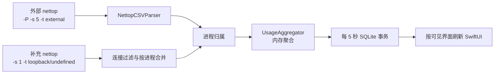
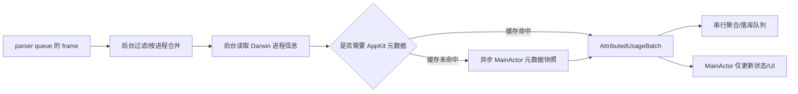

# ByteTrace 性能与功耗等价优化方案

> 状态：第一轮代码优化已实施；真实流量与功耗 A/B 待验收  
> 日期：2026-08-13  
> 适用基线：`4c0c299`（v0.1.25）  
> 核心原则：只减少重复计算、无效 I/O、主线程阻塞和不必要唤醒，不改变当前功能、统计范围与数据口径。

## 实施摘要（2026-08-13）

本次已完成阶段 1A/1B、阶段 2A～2F、阶段 3A～3C 和阶段 4 的第一轮实现：

- 一次 flush 固定 prepare 三条 UPSERT，并通过 reset/clear bindings 复用；同一批每个 appKey 只更新一次 apps。
- 菜单栏只刷新今日日汇总；主窗口概览按所选范围刷新；设置页不参与周期范围查询。
- 短范围排行和总趋势改为 SQLite 端最小聚合结果；应用详情趋势进入详情后按 appKey 查询，不再常驻“应用 × 分钟”明细。
- 保留清理增加 in-flight 门控和专用串行队列；日常删除不再按行数自动触发全库 VACUUM。
- 图表数据只在 points 变化时重建，悬停最近点查找由线性扫描改为二分查找。
- 新增批量写入元数据、SQL 聚合等价和 Int64 饱和边界测试；全量 54 项单元测试已通过。

本次刻意未实施阶段 1C、阶段 3D、阶段 5 和阶段 6：它们涉及写入线程模型、分批删除、进程归属或采集/parser 行为，需要第一轮真实测量证明仍有必要后再决定。正式采集参数、过滤、appKey、schema 和 `accountingVersion = 3` 均未修改。

## 1. 结论

### 1.1 是否有必要优化

有必要，但不是因为当前功能不正确，而是因为现有实现仍存在几处可以确定的无效工作：

- 每 5 秒落库时，在主线程同步执行 SQLite 事务。
- 同一批数据会重复更新 `apps`，并为每条记录重复 prepare/finalize SQL。
- 菜单栏只需要今日汇总，却会连带读取主窗口的完整时间范围和分钟桶。
- 保留策略可能在前一次清理未结束时重复派发，并可能频繁执行全库 `VACUUM`。
- 图表悬停期间会反复重建全部绘图数据并线性搜索最近点。
- 进程归属仍在主线程逐条执行，短连接或短命进程密集时可能形成 CPU 脉冲。

这些问题不会直接破坏数据，但会增加 CPU、磁盘 I/O、内存分配、主线程阻塞和系统唤醒，不符合常驻菜单栏工具应有的低负载目标。

### 1.2 是否会影响当前功能

按本文方案实施，预期不会影响当前功能。以下任何变化都不属于可接受的“性能优化”，一旦出现必须停止上线并回滚：

- 直连、系统代理或 TUN 应用流量少记、多记或重复计算。
- 短连接捕获能力下降。
- 代理运输流量的分类或“不计入应用总量”规则变化。
- `appKey`、应用归属、历史数据连续性变化。
- 今日、本周、本月、最近 10 分钟、最近 1 小时的结果变化。
- 首帧基线、重连、休眠/唤醒、网络切换或退出落盘行为变化。
- 5 秒持久化目标被明显放宽，或崩溃时可能丢失更多内存数据。

本方案保持 `UsageStore.accountingVersion = 3`。如果某项修改需要升级 accounting version，说明它已经改变统计语义，不应归入本轮等价优化。

### 1.3 推荐决策

建议实施，但分阶段推进：

1. 先完成低风险、高收益的 SQLite 批处理、界面查询拆分、保留任务串行化和图表计算优化。
2. 完成静态测试、CSV 回放、SQLite 结果对比和真实场景 A/B 后，再决定是否实施进程归属异步化。
3. `nettop` 参数和采样周期最后再考虑；没有等价证据前不修改。

## 2. 当前性能边界与不可破坏项

### 2.1 当前正式采集结构



### 2.2 必须保留的采集行为

- 保留两个常驻 `nettop` 子进程。
- 外部通道继续使用 `-P -s 5 -t external`。
- 补充通道继续使用连接级 `-s 1 -t loopback -t undefined`。
- 保留 `-c`、`NSUnbufferedIO=YES`、POSIX `read()` 和父进程持有的空 stdin Pipe。
- 两个通道继续各自丢弃首帧，只建立增量基线。
- 补充通道继续只保留：
  - 目标精确命中当前系统代理端点的 `lo0` 应用侧连接；
  - 具有明确本地/远端端点的 `utun*` 应用侧连接。
- 代理进程的 utun 镜像继续丢弃；代理外层流量继续单独展示且不计入应用总量。
- 系统代理关闭时补充通道仍需运行，因为它还承担 TUN 应用流量统计。

### 2.3 必须保留的数据行为

- `appKey` 派生优先级不变。
- `UsageStore.accountingVersion` 保持为 3。
- 日汇总和分钟桶仍是累加写入，不改成覆盖写入。
- 同一批 pending 只有事务成功后才能清空，失败后必须保留并重试。
- `daily_usage`、`usage_buckets`、`apps` 与 `collector_events` 的业务含义不变。
- 今日汇总继续读取 `daily_usage`；细粒度趋势继续读取 `usage_buckets`。
- 分钟桶保留策略仍不删除日汇总和应用信息。

## 3. 本轮不做的事情

- 不关闭补充采集器。
- 不把补充采样周期从 1 秒调大。
- 不回退到单一 `nettop -P`。
- 不引入 Network Extension、抓包、root 权限或第三方依赖。
- 不改变应用分类和代理归属规则。
- 不改数据库 schema 和 accounting version，除非后续出现独立、明确的新需求。
- 不以一次瞬时 `ps` 数值作为完成依据。
- 不把“代码更异步”直接等同于“更省电”；必须用相同工作负载验证。

## 4. 优化目标与验收原则

### 4.1 功能等价目标

固定 CSV 输入下，新旧实现必须满足：

- 每帧输出的有效应用集合一致。
- 每个应用的下载/上传字节完全一致。
- 应用分类、代理过滤结果完全一致。
- 最终 `daily_usage` 和 `usage_buckets` 当前口径数据完全一致。
- 相同批次重复 flush 的行为不变，不能双计。
- 失败重试、停止、退出和网络切换时不能丢 pending。

### 4.2 性能目标

性能指标以同一设备、同一版本、同一流量脚本或同一 CSV 回放进行相对比较，不预设脱离环境的绝对 CPU 数值。

第一轮建议目标：

| 指标 | 目标 |
| --- | --- |
| 隐藏界面时 ByteTrace 自身 CPU | 相对当前基线下降，且不得回退 |
| 5 秒 flush 主线程阻塞 | P95 小于一帧时间，目标 `< 16 ms` |
| 单次 flush SQL prepare 数量 | 从随记录数线性增长降为固定数量 |
| 菜单栏刷新 | 不读取 `usage_buckets`，不构造主窗口时间线 |
| 设置页停留 | 不周期读取主窗口范围数据 |
| 保留清理 | 同一时刻最多一个任务，不自动每日全库 VACUUM |
| 今日概览内存 | 不常驻完整“应用 × 分钟”明细，仅保留界面真正需要的数据 |
| 图表悬停 | 最近点查找从 O(n) 降为 O(log n)，绘图输入不随鼠标移动重建 |

第二轮建议目标：

| 指标 | 目标 |
| --- | --- |
| 主线程进程归属工作 | 只处理必要的 AppKit 元数据和 UI 发布 |
| 采集帧处理 | 后台队列完成过滤、分组和可后台执行的系统调用 |
| ByteTrace 自身 CPU | 在相同流量下较第一轮继续下降，且数据完全等价 |

### 4.3 功耗判断

不能只看 CPU 平均值，还应同时观察：

- CPU 平均值和 P95 峰值；
- 唤醒次数；
- 主线程阻塞时间；
- SQLite 写入次数和耗时；
- 数据库文件写入量；
- 常驻内存和短时分配峰值；
- 两个 `nettop` 子进程是否仍按原参数运行；
- 应用退出后是否存在残留 `nettop` 或诊断进程。

## 5. 分阶段实施方案

## 阶段 0：建立可重复基线

### 目标

在修改代码之前建立可比较的功能和性能基线，防止把网络波动、UI 是否打开或流量类型差异误判为优化收益。

### 方案

准备两类基线：

1. 确定性 CSV 回放：覆盖外部、loopback、undefined、零字节、短连接、代理进程镜像、畸形行和首帧基线。
2. 真实应用场景：覆盖直连、系统代理、TUN、短时下载/上传和应用退出重启。

每组记录：

- 原始 CSV 或可重复输入；
- parser/reducer 最终 delta；
- 归属后的 `appKey` 和分类；
- 内存 SQLite 最终四表结果；
- ByteTrace 与两个 `nettop` 的 CPU、持续时间和采样条件；
- 菜单栏关闭、菜单栏打开、主窗口概览、主窗口设置四种 UI 状态。

### 风险

无产品风险。本阶段只增加测试或诊断能力，不改变正式采集逻辑。

### 完成门槛

- 固定输入可以重复得到相同 SQLite 结果。
- 性能样本明确区分 ByteTrace、外部 nettop 和补充 nettop。
- 所有诊断命令有时间上限，结束后检查残留进程。

## 阶段 1：降低每 5 秒 SQLite 写入开销

### 当前问题

`UsageAggregator.flush()` 将 pending 同时映射为日汇总和分钟桶数组；`UsageStore.apply()` 随后分别遍历两组数据：

- 日汇总循环：`upsertApp` + `upsertDailyUsage`；
- 分钟桶循环：`upsertApp` + `upsertBucketUsage`。

每个 pending 条目因此执行两次 `apps` upsert，并且每次 upsert 都重新 prepare/finalize statement。N 个条目约对应 `4N` 次 prepare/step，事务还在主线程触发。

### 1A. 事务内复用 prepared statements

在一次 `UsageStore.apply()` 事务开始后只 prepare：

- 一个 apps upsert statement；
- 一个 daily_usage upsert statement；
- 一个 usage_buckets upsert statement。

循环中使用 `sqlite3_reset` 和 `sqlite3_clear_bindings` 复用，事务结束统一 finalize。

异常处理要求：

- 任一步失败立即回滚整个事务；
- statement reset/绑定错误必须上抛；
- `UsageAggregator.pending` 只在 `store.apply()` 完整成功后清空；
- 不能把事务拆成可能部分成功的多个事务。

### 1B. 每个应用只 upsert 一次

一次 flush 内先按 `appKey` 合并应用元数据：

- `firstSeenAt` 取最早；
- `lastSeenAt` 取最晚；
- 展示名、分类、bundle/path 信息使用最后时间点对应的数据；
- 不改变已存在记录的 `first_seen_at`；
- 不生成新的 appKey。

然后执行：

1. U 次 apps upsert，U 为本批唯一应用数；
2. N 次 daily_usage upsert；
3. N 次 usage_buckets upsert。

这样 SQL prepare 数量固定为 3，step 数从约 `4N` 降为 `2N + U`。

### 1C. 是否立即把 flush 移出主线程

第一小步不建议同时改线程模型。先完成 statement 复用和重复 upsert 消除，测量主线程阻塞是否已经满足目标。

只有仍不满足时，再引入专用串行 persistence queue，并保证：

- 所有 UsageStore 读写都经过同一队列；
- flush 请求不会并发执行；
- 退出时有同步 barrier，确保最后一帧先 ingest、再 flush、最后关闭；
- 网络切换和休眠的 flush 顺序与当前一致；
- UI 查询异步返回时携带请求版本，旧查询不能覆盖新范围。

### 涉及文件

- `Sources/ByteTraceCore/Storage/SQLiteDatabase.swift`
- `Sources/ByteTraceCore/Storage/UsageStore.swift`
- `Sources/ByteTraceCore/Storage/UsageAggregator.swift`（如需调整批次结构）
- `Tests/ByteTraceCoreTests/UsageAggregatorTests.swift`
- `Tests/ByteTraceCoreTests/UsageStoreConcurrencyTests.swift`
- `Tests/ByteTraceCoreTests/UsageStoreMigrationTests.swift`

### 功能风险与控制

| 风险 | 控制措施 |
| --- | --- |
| statement reset 不完整导致沿用旧绑定值 | 每次执行统一 reset + clear bindings，并补空值/多应用测试 |
| app 合并顺序改变展示元数据 | 明确定义 earliest/latest 规则，测试不同顺序输入 |
| 事务失败后部分写入 | 保留单事务和 rollback 测试 |
| 异步 flush 导致退出丢数据 | 异步化单独作为 1C，必须有 shutdown barrier 测试 |

### 验收

- 新旧实现对同一 UsageDelta 序列的四表结果完全一致。
- 故障注入后 pending 保留，下一次 flush 不重不漏。
- prepare 数量不随 pending 数增长。
- 5 秒 flush 主线程耗时达到目标或明显下降。

## 阶段 2：按界面真实需求拆分查询

### 当前问题

当前只用一个 `visibleSurfaceCount` 判断“是否有人看数据”。菜单栏、主窗口概览和设置页共用完整 `refresh()`：

1. 查询今日 daily_usage；
2. 再查询 selectedRange；
3. selectedRange 为今天时，再读取全天所有应用分钟桶；
4. 在内存中生成范围汇总和趋势。

菜单栏不使用 `rangeRecords`、`rangeTimeline` 或 `rangeBuckets`，设置页也不需要周期刷新这些内容，因此存在明确过量读取。

### 2A. 区分观察者类型

用明确的界面需求代替单一计数，例如：

- `menuBar`：需要今日汇总和今日列表；
- `mainOverview`：需要所选范围汇总、总趋势和当前详情数据；
- `settings`：只在进入时需要 bucketStats，不需要周期刷新流量范围。

建议维护观察者集合或分项计数，避免同一个界面重复 appear/disappear 造成状态错误。

### 2B. 拆分刷新入口

- `refreshTodaySummary()`：只查询 `dailyUsage(for:)`，服务菜单栏。
- `refreshSelectedRange()`：只服务主窗口概览。
- `refreshBucketStats()`：继续只由设置页按需触发。
- `refreshAllForTermination()`：仅停止/退出等少量路径需要时调用，不进入周期刷新。

当菜单栏和主窗口同时显示时，可以共享今日查询结果，但不能让菜单栏单独打开时触发主窗口范围查询。

### 2C. 消除“今天”日汇总重复查询

当 `selectedRange == .today` 时，范围汇总直接复用今日 daily_usage 结果，不再次执行相同查询。

### 2D. 用聚合查询代替完整分钟明细

主窗口总趋势只需要每分钟总下载/上传，不需要每个应用的完整元数据。新增只读查询：

```sql
SELECT b.bucket_start,
       SUM(b.download_bytes),
       SUM(b.upload_bytes)
FROM usage_buckets AS b
JOIN apps AS a ON a.app_key = b.app_key
WHERE b.accounting_version = ?
  AND b.bucket_start >= ?
  AND b.bucket_start < ?
  AND a.category != 'proxy_transport'
GROUP BY b.bucket_start
ORDER BY b.bucket_start;
```

SQL 形态最终以 query plan 为准。关键要求是：只返回图表真正需要的每分钟汇总，不重复带回 displayName、bundleID、路径等元数据。SQLite `SUM()` 的 Int64 溢出行为必须单独测试；如果不能保持现有饱和累加语义，则改为分块读取最小字段并在 Swift 中使用现有 `saturatingAdd`，不能用 Double 换取速度。

最近 10 分钟和 1 小时的应用排行也可以直接在 SQL 中按 appKey 聚合，避免先读取“应用 × 分钟”明细再在 Swift 中合并。

### 2E. 应用详情按需查询

进入某个应用详情时，再按 `appKey` 查询该应用的分钟桶：

- 查询结果只包含该应用；
- selectedRange 改变时刷新当前详情；
- 使用请求版本或 range token，防止旧查询覆盖新范围；
- 返回列表后离开详情可释放，避免常驻所有应用的分钟明细。

### 2F. 去掉无意义 SQL 排序

当前 `bucketUsage` 按 `bucket_start`、字节表达式和 `app_key` 排序，但上层随后仍会重新按字典聚合和排序。为新的专用查询分别定义最小必要 ORDER BY，避免 SQLite 创建无用临时排序结果。

### 涉及文件

- `Sources/ByteTraceApp/ByteTraceViewModel.swift`
- `Sources/ByteTraceApp/MenuBarView.swift`
- `Sources/ByteTraceApp/MainWindowView.swift`
- `Sources/ByteTraceApp/SettingsView.swift`
- `Sources/ByteTraceCore/Storage/UsageStore.swift`
- `Sources/ByteTraceCore/Storage/UsageModels.swift`
- 对应 UsageStore 和 ViewModel 测试

### 功能风险与控制

| 风险 | 控制措施 |
| --- | --- |
| 菜单栏与主窗口显示不同步 | 两者共享同一成功 flush 后的刷新时点，分别查询所需快照 |
| SQL SUM 溢出 | 保持 Int64 边界策略，构造边界测试 |
| 代理过滤遗漏 | 聚合 SQL 明确沿用数据库原始值 `category != 'proxy_transport'` |
| 应用详情短暂展示旧范围 | 查询带 range/request generation，旧响应丢弃 |
| today 复用结果后口径变化 | 对比旧路径的 daily/rangeRecords/timeline 输出 |

### 验收

- 只打开菜单栏时，SQLite 日志/测试桩证明没有 bucketUsage 查询。
- 主窗口处于设置页时，不执行 selectedRange 周期刷新。
- 今日、本周、本月及短范围 UI 输出与旧实现一致。
- 今日概览不再常驻全部应用分钟明细。

## 阶段 3：收敛保留清理和 VACUUM 功耗

### 当前问题

- 清理完成前 `lastRetentionCleanupDay` 尚未更新，5 秒定时器可能重复派发任务。
- `UsageStore` 使用同一个连接和锁；后台 DELETE/VACUUM 持锁时，主线程 flush 会等待。
- 删除超过 10,000 行就执行全库 VACUUM。活跃设备可能每天超过阈值，导致周期性重写整个数据库。

### 3A. 单任务门控

增加明确状态：

- `retentionCleanupInProgress`；
- 派发前在主线程设置为 true；
- 完成或失败后统一清回 false；
- 同一天成功完成后写入 `lastRetentionCleanupDay`；
- 修改保留策略时若已有任务执行，不再并发启动第二个任务，而是记录一次待重跑请求。

### 3B. 使用专用串行维护队列

所有 purge 和数据库维护只进入一个 serial queue，避免全局 utility 队列积压多个任务。

如果阶段 1C 已引入统一 persistence queue，则维护操作也进入同一队列，不再同时依赖“主线程 + 数据库锁”协调。

### 3C. 删除与 VACUUM 解耦

第一版建议取消自动按行数触发 VACUUM：

- SQLite 会复用数据库内部空闲页；不 VACUUM 不影响查询正确性。
- 文件不立即缩小是空间取舍，但避免每天全库重写，更符合常驻工具的功耗目标。
- 如确实需要自动收缩，后续根据 `page_count`、`freelist_count`、文件大小和距上次维护时间共同判断，例如仅在空闲页比例较高且至少间隔数周时执行。

不建议仅把 10,000 调成更大的固定阈值，因为它仍不能反映“要重写的保留数据量”和“能回收的比例”。

### 3D. 大量删除分批执行

首次启用 7/30/90 天策略可能需要删除大量记录。可评估按固定上限分批删除，每批一个短事务，在批次之间允许正常 flush 进入队列。

要求：

- cutoff 在任务开始时固定；
- 每批删除结果累加；
- 中断后下次可以安全继续；
- daily_usage 和 apps 不受影响；
- 不能让分批删除与 clearAll 并发。

### 涉及文件

- `Sources/ByteTraceApp/ByteTraceViewModel.swift`
- `Sources/ByteTraceCore/Storage/UsageStore.swift`
- `Tests/ByteTraceCoreTests/UsageStoreConcurrencyTests.swift`
- 新增保留策略调度测试

### 验收

- 任意时刻最多一个保留任务。
- 清理超过 5 秒时不会重复排队。
- 清理期间周期 flush 不丢数据、不双计，并且等待时间有上限。
- 自动日常清理不再触发全库 VACUUM。
- 清理前后当前保留范围和日汇总结果正确。

## 阶段 4：优化图表计算和悬停

### 当前问题

- `chartData` 是计算属性，每次 body 求值都会重新构造两倍于 points 的 slices。
- 悬停事件持续更新 `hoverPoint` 和 `hoverLocation`，导致图表 body 高频重算。
- 最近点使用 `points.min`，每次鼠标移动都是 O(n)。

### 方案

- 在 `points` 变化时一次性生成 ChartData，而不是在鼠标移动时生成。
- points 已按时间有序，最近点改为二分查找 O(log n)。
- 只有最近点或气泡位置实际变化时才更新状态。
- 将悬停浮层拆成更小的子视图，使位置更新尽量不重建 Chart marks。
- 不改变图表样式、分段规则、下载/上传颜色和数值格式。

### 涉及文件

- `Sources/ByteTraceApp/MainWindowView.swift`
- 如需要，可新增纯函数测试文件验证二分查找边界

### 验收

- 同一 points 输入生成的 slices、domain 和颜色与旧实现一致。
- 空数组、单点、跨 segment、首尾位置和等距点均正确。
- 连续悬停时不重复构造完整 ChartData。

## 阶段 5：进程归属移出主线程（测量后决定）

### 为什么不放在第一轮

这是潜在收益较大的方向，但也最容易影响归属、顺序和退出落盘。当前 `SystemProcessIdentityResolver` 在需要读取 `NSRunningApplication` 时依赖主线程；如果简单把整个流程丢到后台，又让主线程同步等待后台，会形成死锁风险。

因此只有阶段 1～4 完成后，实测仍显示归属是主要热点时才实施。

### 目标结构



### 5A. 帧内去重

- 外部 `-P` 已是进程级汇总，保持一进程一 delta。
- 补充通道继续按 `(processName, source)` 合并。
- 同一帧同一 PID 的 identity 只解析一次，loopback/tunnel 可复用。
- 不跨进程名错误复用，继续防止 PID 复用污染。

### 5B. 拆分 resolver

将解析拆成两部分：

1. 后台安全部分：`proc_pidinfo`、`proc_pidpath`、父进程链和时间校验。
2. MainActor 部分：只在缓存未命中时读取 `NSRunningApplication` 必需字段。

禁止：

- 主线程同步等待可能反向 `DispatchQueue.main.sync` 的后台工作；
- 为了少一次 syscall 放弃 PID start time 校验；
- 只按 pid 或进程名长期缓存。

### 5C. 批次与生命周期 generation

每次 collector 启动生成 generation：

- 后台批次携带 lane + generation + frame 序号；
- collector 停止或重启后，旧 generation 的晚到结果不再入库；
- stop/shutdown 通过 barrier 等待当前 generation 已接收帧完成处理；
- 保持最后一帧先 ingest、再 flush 的顺序。

### 5D. 优化 Attribution LRU

当前 `ProcessAttributionCache` 命中时使用数组 `firstIndex` + `remove(at:)` 维护 LRU，最大 2,000 项时每次命中为 O(n)。可改为：

- 基于访问序号的字典，超限时批量淘汰；或
- 真正的 O(1) 链表 LRU。

优先选择实现简单、可测试、不会引入引用环的方案。缓存优化不能降低 PID 复用安全性。

### 涉及文件

- `Sources/ByteTraceApp/ByteTraceViewModel.swift`
- `Sources/ByteTraceCore/Attribution/ProcessIdentity.swift`
- `Sources/ByteTraceCore/Attribution/ProcessAttributor.swift`
- `Sources/ByteTraceCore/TrafficFilter.swift`
- `Sources/ByteTraceCore/NettopCollector.swift`（仅批次交付边界需要时）
- `Tests/ByteTraceCoreTests/ProcessAttributorTests.swift`
- 新增顺序、generation、停止/退出测试

### 验收

- 固定 CSV 回放的归属和 SQLite 结果完全一致。
- PID 复用、同名新进程、进程退出和父进程链测试通过。
- 重启前的晚到批次不会进入新 generation。
- stop/shutdown 后没有未落盘已接收样本。
- 主线程采样中不再出现逐条完整归属链。

## 阶段 6：解析器微优化（低优先级、严格等价验证）

### 可评估项

当前 nettop 输出包含 `state`，生产过滤、归属和存储并不依赖 `connectionState`；`connectionTarget` 在解析出本地/远端 endpoint 后也不参与正式逻辑。

可在前述优化完成后评估：

- 从 `-J` 移除 `state`，减少子进程输出与每行 String 分配；
- 生产路径不再长期保存 `connectionTarget`/`connectionState`；
- 只在探针诊断模式保留需要的原始字段；
- 在 parser queue 内完成补充过滤和按进程聚合，减少 `ParsedRow -> NettopDelta -> reducer` 中间数组。

### 为什么必须最后做

这部分直接接触 nettop 输出格式。即使代码静态上未使用字段，也必须验证不同 macOS 版本下：

- 表头和进程列识别不变；
- 帧数和采样周期不变；
- 有效行数不变；
- 每帧、每进程上下行字节不变；
- 直连、系统代理、TUN 和短连接结果不变。

未通过完整 A/B 前，不修改正式参数。

## 6. 实施顺序与停止条件

### 推荐顺序

| 顺序 | 阶段 | 风险 | 预期收益 | 是否建议立即做 |
| --- | --- | --- | --- | --- |
| 0 | 可重复基线 | 低 | 为后续提供可信结论 | 是 |
| 1 | SQLite statement 复用和应用去重 | 低 | 降低周期 CPU、I/O 和主线程阻塞 | 是 |
| 2 | 界面查询拆分和 SQL 聚合 | 低到中 | 显著减少可见界面时回读、内存和渲染 | 是 |
| 3 | 保留任务串行化、取消频繁 VACUUM | 低到中 | 降低每日磁盘重写和锁等待 | 是 |
| 4 | 图表数据缓存和二分查找 | 低 | 降低交互 CPU | 是 |
| 5 | 归属异步化 | 中到高 | 降低高流量/短进程场景主线程 CPU | 测量后决定 |
| 6 | parser/nettop 字段微调 | 中 | 降低连接级解析分配 | 最后评估 |

### 停止条件

完成阶段 1～4 后重新测量。如果满足以下条件，阶段 5～6可以暂缓：

- 隐藏界面时 ByteTrace 自身 CPU 已稳定处于可接受范围；
- flush P95 主线程阻塞小于目标；
- 打开菜单栏/设置页不再出现明显 SQLite 和布局峰值；
- Activity Monitor 的能耗趋势已明显改善；
- 剩余主要成本位于系统补充 nettop，而非 ByteTrace 本体。

不要为了继续追求更低数字而进入高风险重构。

## 7. 验证矩阵

### 7.1 静态与单元测试

| 范围 | 必测内容 |
| --- | --- |
| Parser | chunk 边界、首帧、零字节、畸形行、连接端点、字段顺序 |
| TrafficFilter | lo0 精确代理端点、utun、通配端点、代理镜像 |
| Attribution | pid 复用、start time、父进程链、代理分类、缓存淘汰 |
| Aggregator | 分钟跨界、跨日、溢出、pending limit、失败重试 |
| UsageStore | 新旧结果等价、事务回滚、并发、清理、无重复计数 |
| ViewModel | surface 类型、范围切换、旧查询丢弃、停止/退出顺序 |
| Chart | 数据转换、segment、二分最近点、空/首/尾边界 |

### 7.2 确定性数据等价测试

对同一 CSV 输入分别运行优化前后实现，比较：

1. parser frame 数量；
2. 每帧 raw deltas；
3. supplemental accepted deltas；
4. attributed appKey/category；
5. daily_usage 当前口径全量结果；
6. usage_buckets 当前口径全量结果；
7. collector_events 中关键生命周期事件；
8. pending 在失败重试后的最终结果。

字节结果要求完全一致，不接受百分比误差。

### 7.3 真实场景

至少覆盖：

- 不启用代理的直连下载和上传；
- 系统 HTTP/HTTPS/SOCKS 回环代理；
- TUN/utun 应用流量；
- 多个短连接；
- 浏览器及 helper 子进程归属；
- 代理进程外层流量单独展示；
- 应用停止/启动；
- 系统休眠/唤醒；
- 网络接口变化；
- 跨分钟和跨零点；
- 菜单栏隐藏、打开、主窗口概览、设置页和应用详情。

### 7.4 性能 A/B 方法

每组使用相同设备、电源状态、网络场景、运行时长和 UI 状态。分别记录：

- ByteTrace、external nettop、supplemental nettop CPU；
- ByteTrace 主线程采样栈；
- 每次 flush 耗时与 pending 数量；
- 每次 refresh 的 SQL 类型、返回行数和耗时；
- 进程唤醒、SQLite 写入和数据库文件增长；
- 内存稳定值与刷新时峰值。

结论至少来自重复样本和调用栈，不能把一次瞬时 CPU 数值当作长期平均。

### 7.5 资源安全

- 所有诊断命令设置明确时长或超时。
- 禁止无界递归 SQLite 查询。
- 优先使用范围明确、可由索引约束的查询。
- 诊断结束检查 `ByteTraceApp`、`ByteTraceProbe`、`nettop`、`sqlite3` 等残留进程。
- Probe 使用 `:memory:` 数据库，不写入正式 usage.sqlite3。

## 8. 回滚策略

每个阶段独立提交，不把低风险 SQL 优化和高风险线程模型重构放在同一提交。

建议提交边界：

1. 测试/测量基线；
2. statement 复用和 apps 去重；
3. UI 查询拆分；
4. retention 调度和 VACUUM 策略；
5. 图表优化；
6. 归属异步化；
7. parser 字段优化。

由于阶段 1～5不修改 schema 和 accounting version，回滚代码后仍可继续读取现有数据库。任何阶段出现以下情况应立即回滚：

- 固定 CSV 或 SQLite 结果不一致；
- 真实代理/TUN/短连接出现缺失；
- 退出或重连出现 pending 丢失；
- CPU 降低但唤醒、I/O 或内存明显恶化；
- 主线程出现新的死锁、长等待或旧响应覆盖。

## 9. Definition of Done

本轮性能与功耗优化只有同时满足以下条件才算完成：

- [x] 双通道和 nettop 采样周期保持不变（本轮未修改采集链路）。
- [x] `UsageStore.accountingVersion` 保持为 3。
- [ ] CSV 回放的每应用字节、分类和 SQLite 结果完全一致。
- [ ] 直连、系统代理、TUN、短连接真实验收通过。
- [x] 每 5 秒 flush 不再为每条记录重复 prepare SQL。
- [x] 同一批次每个 appKey 只更新一次 apps。
- [x] 菜单栏不读取分钟桶或构造主窗口时间线（代码路径已拆分）。
- [x] 设置页不周期刷新 selectedRange（导出前会主动读取最新快照）。
- [x] 今日汇总不重复查询。
- [x] 保留清理最多一个任务，日常清理不自动全库 VACUUM。
- [x] 图表悬停不重建完整绘图数据，最近点查找为 O(log n)。
- [ ] 主线程、CPU、唤醒、SQLite I/O 和内存 A/B 有可复核结果。
- [ ] stop、shutdown、休眠和网络切换的最后一帧与落盘顺序通过测试。
- [ ] 诊断结束无残留子进程。
- [x] 未引入第三方依赖和额外系统权限。

## 10. 最终建议

本轮优化值得做，但应把目标明确限定为：

> 保持 ByteTrace 当前所有正常需求、统计能力和数据口径，通过减少重复 SQL、无关查询、全库维护、主线程计算和 UI 重算来降低性能与功耗成本。

建议立即实施阶段 0～4。它们针对的是代码中已经确认的无效工作，功能风险可通过确定性测试控制。阶段 5 的进程归属异步化只在第一轮优化后仍有明确热点证据时推进；阶段 6 的 nettop/parser 微调必须最后执行，并以完整数据等价 A/B 作为上线门槛。
